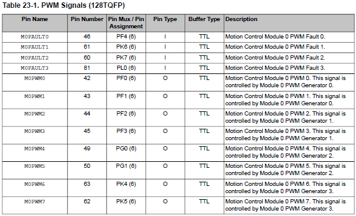

# ELF74
<!--  -->
Repositório destinado a prática 6 - desafio da disciplina de Sistemas Embarcados, turma ELF74, ministrada na Universidade Tecnológica Federal do Paraná (UTFPR). 

## Professor orientador

Hugo Vieira Neto

## Placa de desenvolvimento

[ARM® Cortex®-M4F-Based MCU TM4C1294 Connected LaunchPad™ Evaluation Kit](https://www.ti.com/tool/EK-TM4C1294XL)

## Analise e discussão da atividade
### Exercício prático 6 - Desafio

A resolução do desafio proposto pode ser encontrada dentro do seguinte [retositório.](https://github.com/inafucoAugusto/ELF74_RTOS/blob/main/Projects/desafio/src/desafio.c).

O desafio consiste em um sistema de tarefas que acionem os 4 leds presentes na placa com intensidades diferentes. Para que isso seja possível a implementação de um PWM será necessária.

Além disso, o sistema deverá apresentar no mínimo 5 tarefas, sendo uma delas responsável por controlar as demais instâncias de uma tarefa acionadora (leds).

O sistema deve se comportar da seguinte forma:
- Ao se pressionar o primeiro botão o sistema deverá entrar em algum tipo de configuração, de modo que seja possível alterar o valor do duty cycle do led; OBS: deve haver algum tipo de indicador para representar qual led está selecionado.

- Ao se pressionar o segundo botão, deve se aumentar o valor do duty cycle do led selecionado; se o mesmo já estiver em seu valor máximo deverá voltar a zero.

### Discussão do desenvolvimento 

Inicialmente foram criadas instâncias para cada LED do sistema. Como todos eles apresentavam características (campos/variáveis) iguais, porém de valores diferentes decidiu-se criar uma struct, representada a seguir, para se trabalhar com os mesmos. 

<div><center>


</center></div>

- uint8_t : Indica qual led está atrelada a estrutura
- duty_cycle : Indica qual o valor de duty cycle o led contém
- thead_id : Indica qual a flag que o led espera para que seja possível a execução da sua thread

Com o mesmo princípio citado anteriormente, não há razão para a inicialização de 4 threads distintas (thread1, thread2, thread3, thread4), sendo uma para cada led. Logo, foi criada uma task genérica que recebe uma estrutura de led que por consequência será a responsável pelo acionamento dos mesmos quando necessário e possível.

```
    void thread_led(void *arg){
        uint8_t state = 0;
        LED *target_led = arg;
        while(1){
            osThreadFlagsWait((*target_led).thread_id, osFlagsWaitAny, osWaitForever);
            state ^= (*target_led).led;
            LEDWrite((*target_led).led, state);
            osDelay((*target_led).duty_cicle);

            state ^= (*target_led).led;
            LEDWrite((*target_led).led, state);
            osDelay(10 - (*target_led).duty_cicle);
        }
    }
```

Um destaque para o uso da variável thead_id; está representa qual é o sinal que a thread espera para que possa realizar o acionamento ou desligamento do led.

Outro requisito foi a utilização de um botão para o inicio de configuração e outro para alterar o valor propriamente. Entre tanto o kit em que o sistema estava sendo testado/desenvolvido houve um problema de hardware em que quando se pressionava o botão 2 o botão 1 também ia para uma leitura de HIGH; o inverso não se aplica no problema descrito. Logo, o requisito de selecionar um led com um botão e alterar o seu valor de duty cycle com o outro botão não foi possível de ser atendido. 

Como solução para isso foi realizada a seguinte alteração; Ao se pressionar o botão, qualquer um deles devido ao problema, todos os leds terão seu valor de duty cycle alterados, sempre de forma crescente. Se os mesmos chegarem ao seu valor máximo retornaram ao valor mínimo. Desta forma conforme os botões são pressionados os leds aumentam sua "intensidade de brilho" até o máximo e logo após voltam a sua "intensidade mínima".

A seguir o uml final da solução


## Referências
- The Definitive Guide to ARM® Cortex®-M3 and Cortex®-M4 Processors, Third Edition by Joseph Yiu
- https://www.keil.com/pack/doc/CMSIS/RTOS2/html/group__CMSIS__RTOS__SemaphoreMgmt.html#ga7e94c8b242a0c81f2cc79ec22895c87b
- https://www.keil.com/pack/doc/CMSIS/RTOS2/html/group__CMSIS__RTOS__Definitions.html#ga6c0dbe6069e4e7f47bb4cd32ae2b813e
